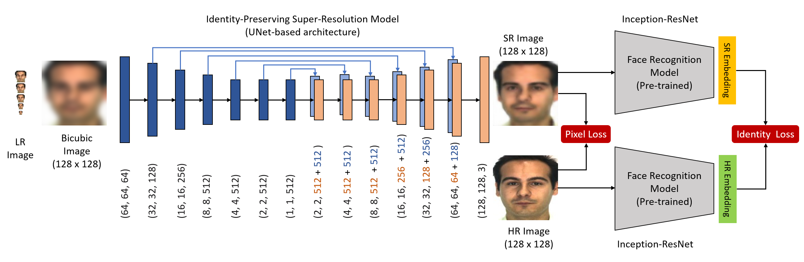
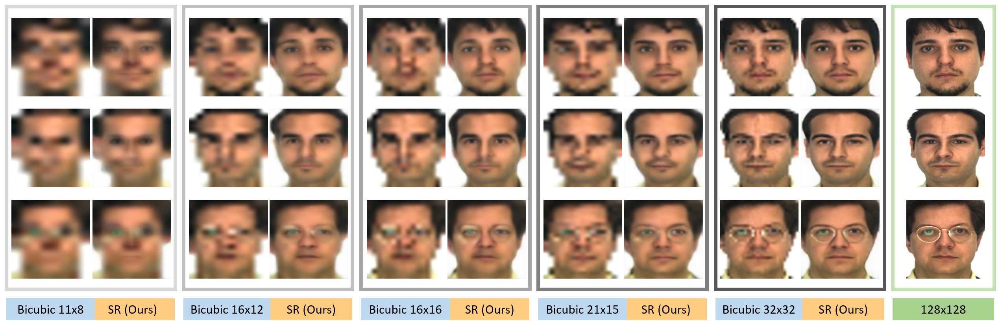

# IPU-Net
We propose an Identity-Preserved U-Net which is capable of super-resolving very low resolution faces to their high resolution counterparts while preserving identity-related information. We achieve this by training a U-Net with a combination of a reconstruction and an identity-preserving loss, on multi-scale low resolution conditions.


## Important Links
[Paper](https://arxiv.org/abs/2010.12249) </br>

## Model Architecture
Our proposed method includes two deep neural networks which are designed to produce super-resolution faces from the lowresolution counterparts that are optimized for both visual quality and face recognition. The first network is an autoencoder with skip-connections (U-Net) and the other network is a pre-trained face recognition model with an Inception-ResNet architecture. The IPU-Net generates the super-resolved (SR) faces from the upsampled low-resolution versions by learning the mapping between the pairs. During training, the FRNet produces discriminative, low-dimensional embeddings for both SR and high-resolution (HR) faces in order to compute the identity loss.

<p align="center">
  
</p>


## Requirements: 
```
Python 3.7
TensorFlow 2.0+
Pillow
Scikit-learn
OpenCV
```

## How to train
To Train the model, run this:
```
python train.py
```

## Result

<p align="center">
  
</p>
